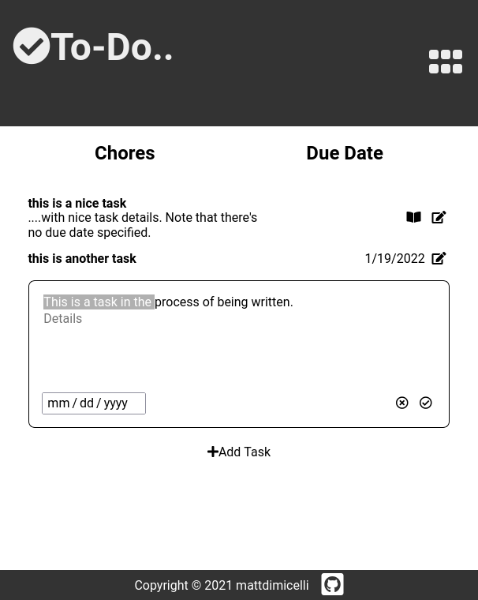

# Readme
# ToDo App

## Overview

A ToDo app which allows the user to keep track of his or her "things to do", 
with advanced features such as optional details, due dates, and separate lists 
to better organize the tasks.  The app has responsive-design so that it can work
on any device.  It's actually a refactored version of an older ToDo project of 
mine which utilized the Web Storage API to persist the ToDo data through 
different browser sessions.  Wanting to enable access to saved ToDo data from any 
client, as well as allow multiple users, I implemented Google Firebase's 
Firestore database and Authentication.  

### Screenshot

  

### Links

- [Live site](https://todo-app-e225d.web.app/)
- [Repo](https://github.com/mattdimicelli/todo-firebase)

## My process

### Built with

- Vanilla JS, CSS, and HTML with Semantic HTML5 elements
- OOP principles.  The app is modularized using ES6 modules and JS classes
- Webpack with a custom-made configuration.  Utilizes plugins and loaders
- npm scripts for development and production purposes (ex. to enable source maps
for development)
- A mobile-first, responsive design
- Normalize.css for cross-browser homogenization of default styles
- Backend services such as Firebase Firestore and Firebase Authentication with 
FirebaseUI (which provides some nice pre-built buttons for logging in with different authentication providers)

### What I learned

So much was learned from this project.  My JS, CSS, and HTML skills all improved
as a result of this practice. For my JS, I made a point to experiment with different syntaxes to arrive at the same end (for example, using promise-chaining with 
.then(), as well as async/await syntax).  For the HTML, I focused on being as 
semantic as possible.  The CSS in this app relies heavily on Flexbox, but is 
really quite extensive, and even uses an old-school float.

I experienced the frustration first-hand of choosing FirebaseUI as per Firebase's suggestion, in order to save myself the work of creating that UI, only to realize
that FirebaseUI was not compatible with the most recent Firebase API, requiring 
extensive patience as I attempted to follow less-than-stellar documentation.    

Since this was my first project utilizing backend services, I learned the basics
of how user authentication works and how to add Google, Github, and email 
authentication provider functionality to my app.  I always contemplated and 
implemented the transformations to my local data necessary to save them to the 
Firestore database, and vice-versa.  

One option for my that I enabled which I though was particularly cool is called
"database persistence", which essentially replicates the functionality of 
localStorage, since it uses a cached version of the data from the online Firestore database (if there is in fact data in the database) when the internet connection
is dropped, and it updates the Firestore database once and internet connection is reestablished.

